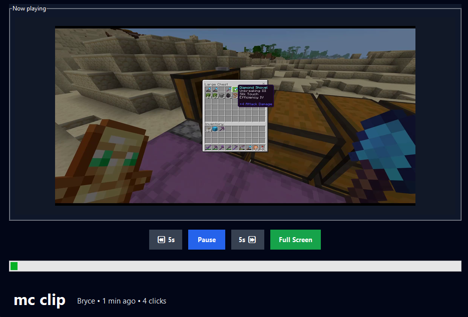

# Rip-Off-YouTube
A python application for managing and searching videos with a graphical user interface built using Tkinter.

## Technologies Used
- Python
- Tkinter
- OpenCV
- Pillow

## How to Run the Program

1. Ensure you have Python installed on your system.
2. Install the required dependencies by running:
   ```bash
   pip install opencv-python Pillow
   ```
3. Navigate to the project directory in your terminal or command prompt.
4. Run the application using:
   ```bash
   python main.py
   ```
## Features
- Manage and search videos within a graphical user interface.
- Support for various video file formats including MP4, MOV, AVI, MKV, WMV, MPEG, MPG, and M4V.
- Real-time search functionality with instant filtering of media items.
- Display of video metadata such as title, uploader, upload date, and click count.
- Responsive and user-friendly interface built with Tkinter.

## Images of the Program at Work
 
