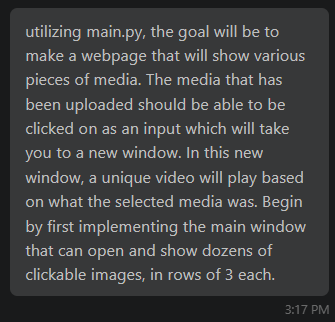
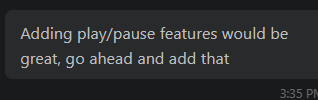

- My idea that I worked with Copilot to create was a knock-off of YouTube. I started off by listing the goals I had for the project, and then a basic start. After this, it was pretty much smooth sailing of adding single features that I knew of from YouTube to make the experience similar, such as creators, views, and the ability to make a video go fullscreen.

- My approach to asking questions started out very structured, very thought out so that Copilot could understand what I wanted exactly. Once the base program was fully implemented, I started asking simpler and simpler questions, almost just short confirmations or quick mentions of errors that appeared.

- The big part of the process was simply how fast it was. I knew that working with AI was a very fast way of coding, but I don't think I've ever seen this much code that works as efficiently as it does get spat out in so little time in my life.

- I learned that AI is one incredibly useful tool that changes the game in creating programs at fast speeds. I wasn't quite aware of just how useful and accurate AI is with coding projects like this nowadays. 

- If I had to start from scratch on this program and do it over, I would likely try to simplify some of the things I asked for at the start, as there were a lot of features early on that were functional but not what I was looking for in the system. By making more specific requests I could have removed the need to remove some of these things that were added to the program.

